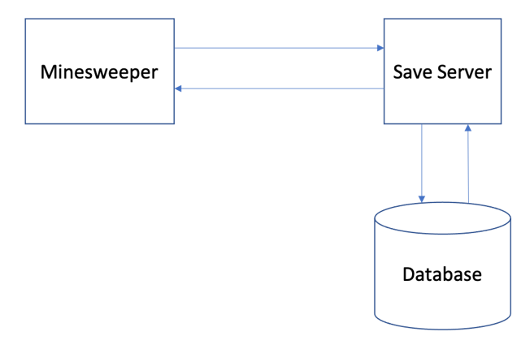
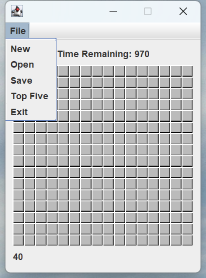
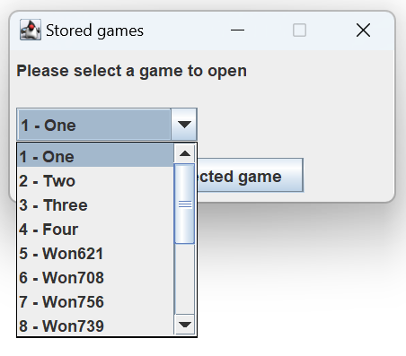
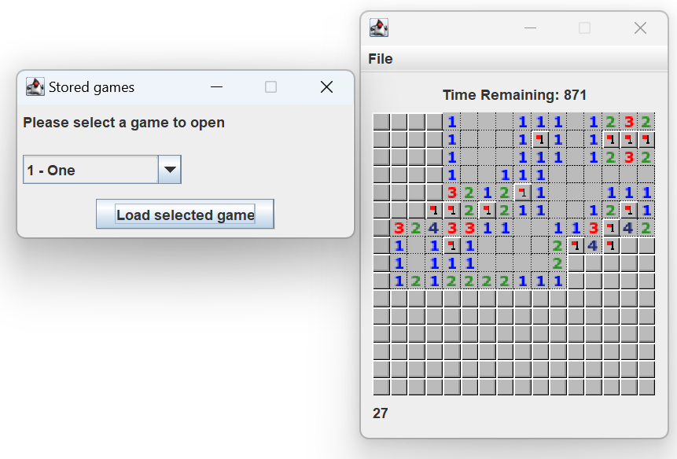
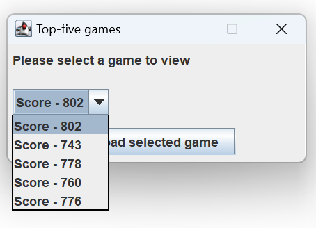
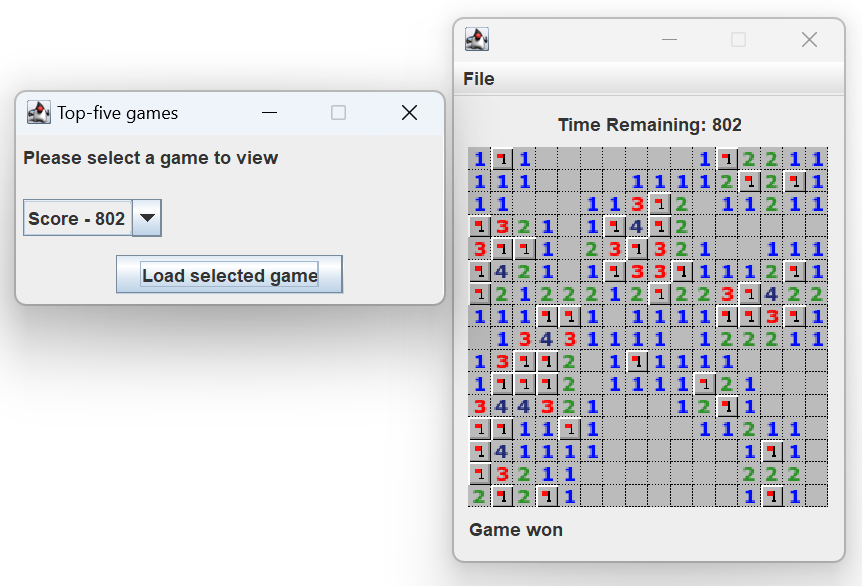

<h2 style="text-align: center"> 
    Minesweeper Game Implementation
</h2>

### Introduction
This is a Minesweeper game implementation with saving, loading and ranking functions performed on a server with a backend database.

### Features
* The game has a 1000 second timer that will count down to zero, and the remaining time on the counter will be your score. When the counter hits zero, you lose, just as if you had hit a mine
* A game can be saved to the server. A previously saved game can be loaded; and if the game is not finished, you can continue to play it. 
* Saving and loading games are performed on a server. The server has a database where the saved games are stored. The server is a network server that accepts connections from the Minesweeper application and can handle multiple connections from different Minesweeper applications. The Minesweeper application can send over a copy of the game state (including the amount of time left) to the save server, which will store that data in the database. 
* When you won a game and your score is among the top five. The game state will be saved into the database. You can view the games with top 5 high scores by selecting the "Top Five" menu item in the Minesweeper application and select the game you are interested in.

#### Structure

 
 

#### Menu

 
 

#### Saved Games

 
 

#### Saved Game Loaded

 
 

#### Top Five High Score Games

 
 

#### One Top-Five Game Loaded

 
 

